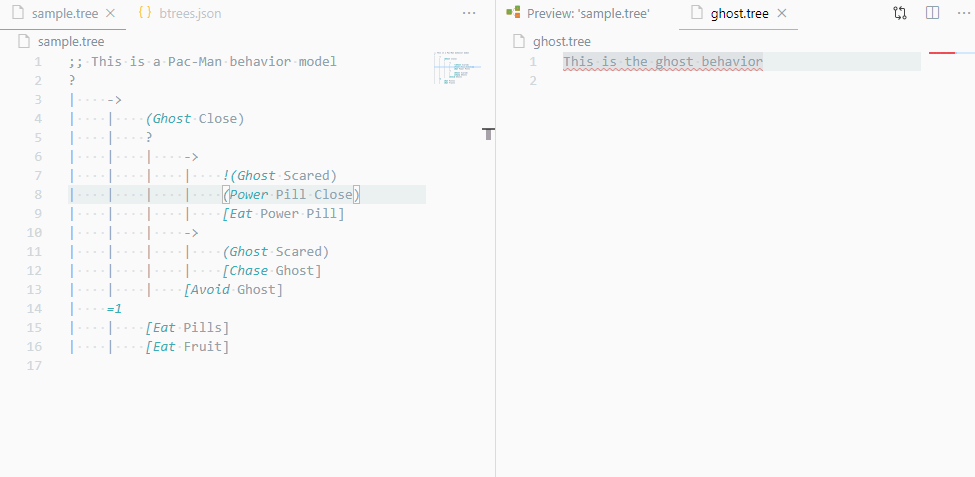
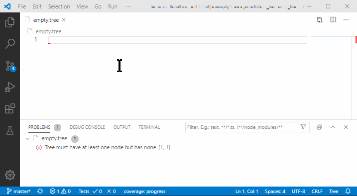
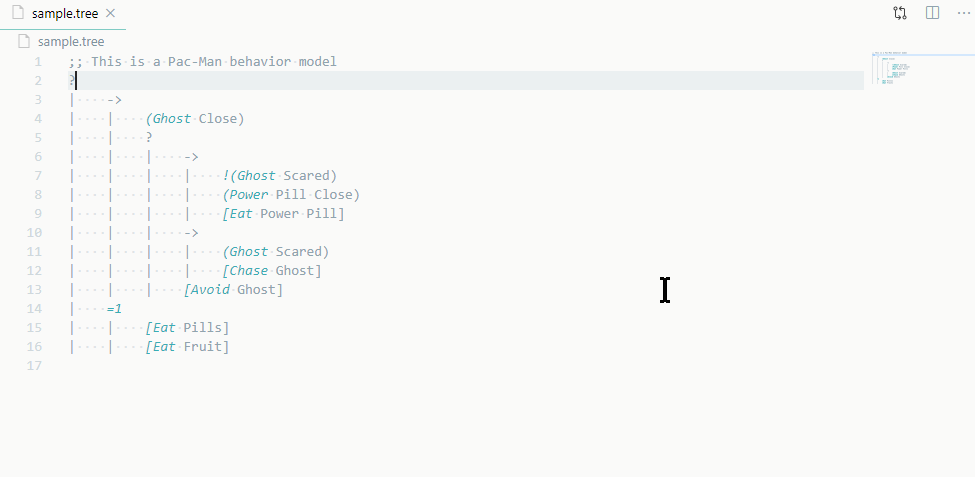

# Change Log

## Unpublished

Fixed

- support for nested trees (action name validation accepts tree file names as valid action names)
- updated to latest behavior_tree_service dependency with fixed action activation
- fixed negated condition value flipping (double clicking on negated condition was not flipping its status)

## 1.4.x

Added

- Auto-completion with action and condition names used in any tree in the same directory
- `btrees.json` manifest with all _supported_ actions and conditions (this is opt-in)
- Warnings when undeclared action and condition is used
- Code action to add one or all undeclared actions/conditions

## 1.3.x

- Support for comments (text after `;;`) in the tree syntax.
- Support for the `[Tab]` key

### 1.3.1

- Fix: pre-opened documents in the workspace are parsed upon activation irrespective of their _language_.

### 1.3.2

- Fix: Tree is not confined to its own viewbox and the page containing it does not scroll, when it is mouse-wheel zoomed.

## 1.2.x

Enable the `editor.formatOnType` in your VS Code settings. This enables following behaviors:

- When you type `|`, white-space corresponding to one `tab` (per your configuration) is inserted
- When you press `[Enter]`, the same indentation is inserted to the new line
- When you press `[Backspace]` one level of indentation is removed
- When you press `Ctrl+[` or `Cmd+[`, the active row (or all selected rows) are indented +1 level
- When you press `Ctrl+]` or `Cmd+]`, the active row (or all selected rows) are un-indented -1 level

## 1.0.x

Basic tree visualization and status changing upon double-click.

