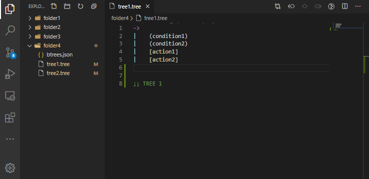

# VS Code Behavior Tree editor

<!-- [](https://marketplace.visualstudio.com/items?itemName=jan-dolejsi.btree)
[](https://marketplace.visualstudio.com/items?itemName=jan-dolejsi.btree)
[](https://marketplace.visualstudio.com/items?itemName=jan-dolejsi.btree&ssr=false#review-details)
[](https://marketplace.visualstudio.com/items?itemName=jan-dolejsi.btree) -->
[](https://github.com/jan-dolejsi/vscode-btree/actions?query=workflow%3ABuild)

Behavior trees are a technique used in video games and robotics to model behavior AI. Their use has become increasingly popular due to their simple implementation, ease of understanding, and flexibility.\
This extension provides visualization of trees authored in the language suggested by [Dan Abad's behavior_tree project](https://github.com/0xabad/behavior_tree/).

Specifying behavior trees in a declarative concise way gives you these benefits:

- the model is very readable; a subject matter expert can review it for correctness
- the implementation of action logic is separate (see [SoC](https://en.wikipedia.org/wiki/Separation_of_concerns))
  - the logic is testable
  - implementation may evolve separately
  - new version of the tree may be deployed without pushing any code changes (which are inherently more difficult to validate and verify)

## Features

### Behavior Tree Visualization and Testing

Open a `*.tree` that adheres to the [syntax](https://github.com/0xabad/behavior_tree/#syntax).\
Right-click on the editor text and select Preview or invoke the _Open Preview to the Side_ command.

> Note that for the _preview_ options to be visible, the file has to be _saved_.

Dense trees with longer action/condition names may be stretched using _Shift_ + _Mouse Wheel_. Here are other ways to manipulate the view:

| Tree Manipulation  | Gesture                         |
| :----------------: | ------------------------------- |
|        Pan         | Hold left mouse button and move |
|        Zoom        | Mouse Wheel                     |
| Horizontal Stretch | Shift + Wheel                   |
|  Vertical Stretch  | Shift + Alt + Wheel             |

Double-click on a condition node to toggle its state between _success/_failed_.\
Double-click on an action node to switch its state between _running_/_success_/_failed_. Hold the _shift_ key to transition from _running_ to _failed_.


### Behavior Tree Editing

Enable the `editor.formatOnType` in your VS Code settings. This enables following behaviors:

- When you type `|`, white-space corresponding to one `tab` (per your configuration) is inserted
- When you press `[Tab]`, one tree indentation level is inserted (when multiple lines are selected or while your cursor is in the _indentation_ part of the code line)
- When you press `[Enter]`, the same indentation is inserted to the new line. In addition, if you pressed enter after `->`, `?` or `=N` nodes, additional level is added.
- When you press `[Backspace]` one level of indentation is removed
- When you press `Ctrl+[` or `Cmd+[`, the active row (or all selected rows) are indented +1 level
- When you press `Ctrl+]` or `Cmd+]`, the active row (or all selected rows) are un-indented -1 level


> You can enable the on-type formatting selectively just for the _Tree_ language and/or just for one workspace using the `settings.json` in your workspace `.vscode` or in your global user settings:
>
> ```json
> {
>     "[tree]": {
>         "editor.formatOnType": true
>     }
> }
> ```

### Action and Condition name validation

When authoring larger trees, or multiple trees in one folder,
it becomes hard to keep the names of all _conditions_ and _actions_
in sync across multiple files.

This extension works with the concept of _tree workspace_, which consists of
a directory containing one ore more `.tree` files and an optional `btrees.json` file. The `btrees.json` structure is expected as follows:

```json
{
  "actions": {
    "action1": {},
    "action2": {},
  },
  "conditions": {
    "Condition XYZ": {}
  }
}
```

Where both the `actions` and `conditions` are optional.
However, once the `actions` / `conditions` property is created, VS Code starts flagging
all undeclared actions and conditions in all the trees in the directory.
The undeclared actions may be added by simply invoking the code action (via the light bulb icon).


The empty `{}` structures in the json sample above are free form so far.
It may be used for documentation, or bindings to the system you want to automate with the trees.

> This feature is available as opt-in. Create/delete the `btrees.json` and/or the `actions` and/or `condition`
> nodes within to opt in or out of the action/condition name validation.

The format of the file is JSON, so the same file may be used by other parts of the system
to statically validate the system at continuous integration time or at start of execution.

> As a special case, action names that match name of another behavior tree file
> in the same folder (but without the `.tree` extension) are implicitly added to
> the list of _declared_ actions.

### Action and Condition definition and references

The _Action_ and _Condition_ nodes in trees support the _Go to Definition_ feature
via context menu, _F12_ key, or _Control+Click_. If the directory contains the `btrees.json`,
the editor will jump to the corresponding action/condition element in the JSON structure.
If the `btrees.json` is not present, the editor shows all references instead (as there is no one clear definition point).

The _Action_ and _Condition_ tree nodes support the _Go to References_ and _Find all References_ in the context menu. References across all trees in the same directory are shown.



## Release Notes

See [CHANGELOG.md](CHANGELOG.md).
